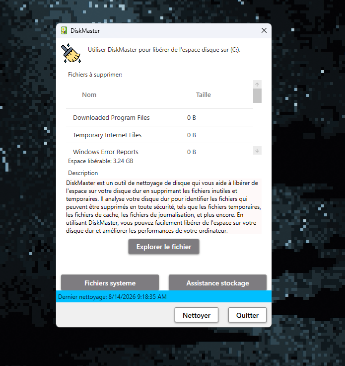

# 🧹 DiskMaster

DiskMaster est un outil de nettoyage de disque pour Windows, développé en C# avec WPF.

Le projet est inspiré de l'ancien outil Windows Disk Cleanup et permet d'analyser plusieurs emplacements du système afin d'identifier les fichiers temporaires pouvant être supprimés pour libérer de l'espace disque.

## ✨ Fonctionnalités

### 🔍 Analyse du disque

DiskMaster analyse les dossiers suivants :

- Downloaded Program Files
- Temporary Internet Files
- Windows Error Reports
- DirectX Shader Cache
- Delivery Optimization Files
- Recycle Bin
- Temporary Files
- Thumbnails

L'application calcule automatiquement l'espace total pouvant être libéré.

### 🗑️ Nettoyage

Le bouton **Nettoyer** supprime les fichiers présents dans les catégories analysées.

Après le nettoyage, DiskMaster :

- Recalcule l'espace disponible à nettoyer
- Met à jour la liste des fichiers
- Enregistre la date du dernier nettoyage

### 🛠️ Fichiers système

DiskMaster permet également d'ajouter des catégories système à l'analyse :

- Windows Update Cleanup
- Microsoft Defender Antivirus
- Device driver packages
- Language Resource Files

### 📂 Explorer les fichiers

Il est possible de sélectionner une catégorie et d'ouvrir directement son dossier dans l'Explorateur Windows.

### 💾 Assistance stockage

DiskMaster propose également un accès direct aux paramètres **Storage Sense / Assistant Stockage** de Windows.

### 📰 Actualités

L'application peut récupérer et afficher les dernières informations et mises à jour du projet.

## 🖥️ Technologies utilisées

- C#
- .NET
- WPF
- Visual Studio 2026
- Windows

## 📦 Installation

DiskMaster sera disponible sous forme d'un installateur Windows.

Téléchargez le fichier `Setup.exe` depuis la section **Releases** du dépôt, puis exécutez l'installateur.

L'installateur est créé avec **Inno Setup**.

## 🛠️ Compilation depuis les sources

1. Clonez le dépôt.
2. Ouvrez la solution DiskMaster avec Visual Studio 2026.
3. Restaurez les dépendances si nécessaire.
4. Compilez le projet en mode `Release`.
5. Le fichier compilé sera généré dans le dossier de sortie du projet.

## ⚠️ Important

Certaines catégories analysées par DiskMaster peuvent contenir des fichiers utilisés par Windows ou protégés par le système.

Certaines opérations peuvent nécessiter des autorisations administrateur.

Les fichiers qui ne peuvent pas être supprimés sont ignorés afin d'éviter l'arrêt complet du nettoyage.

## 📸 Aperçu

Ajoutez ici une capture d'écran de DiskMaster :

```text
